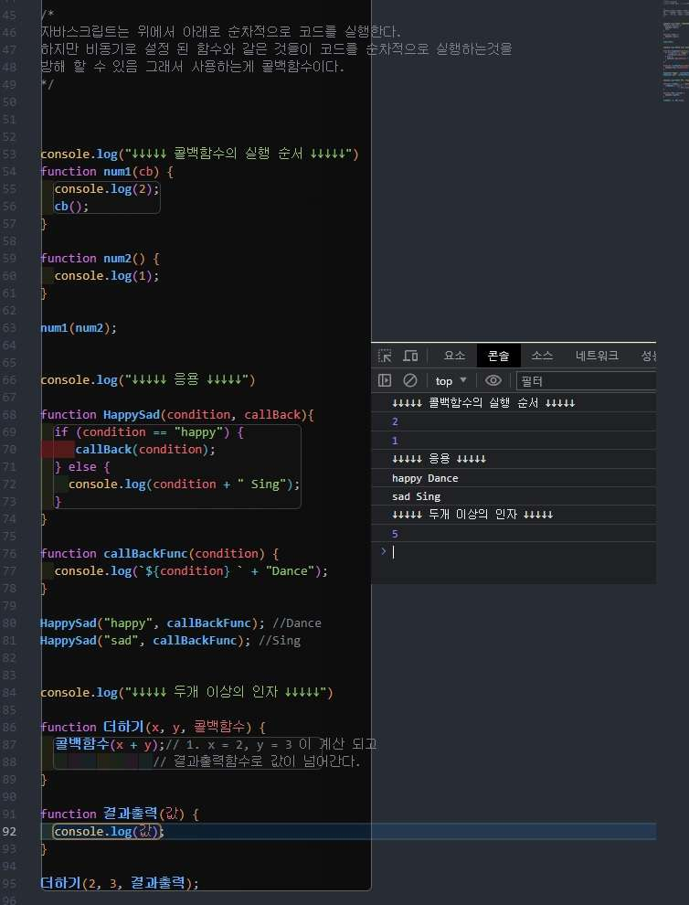
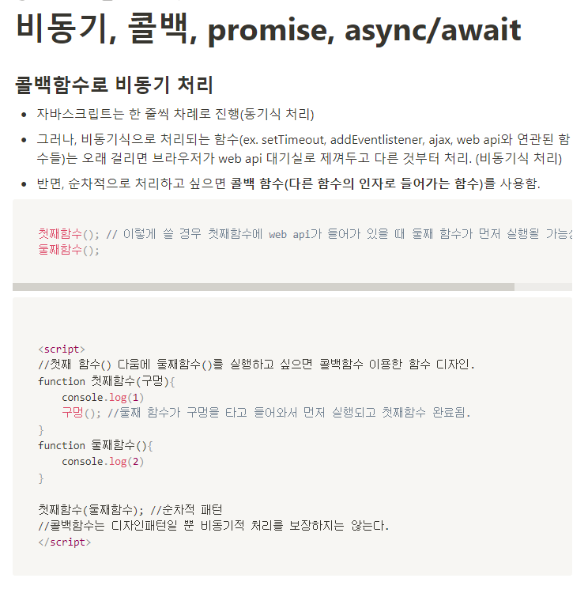
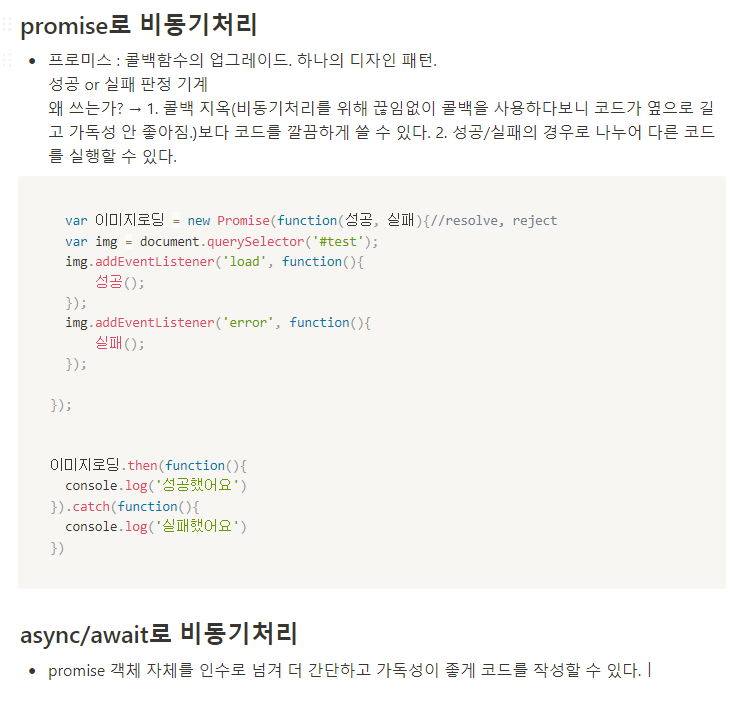

## <바닐라 JS로 크롬 앱 만들기팀 3주차 스터디 보고서>
---
### <이번주 스터디 진행 상황>

- 비동기/동기에 대해 학습 후 발표 진행 하였습니다.
---
### <개인별 주간 학습일지>
-최태관님

 


-정다희




-김민태

동기의 대략적인 특징

• 동시에 여러 작업을 수행할 수 없다.
• 흐름을 예측하기 쉽다. 먼저 수행되고 나중에 수행되는 것들이 명확하다.
비동기의 대략적인 특징

• 동시에 여러 작업을 수행할 수 있다.
• 흐름을 예측하기 어렵다. 즉 무엇이 먼저 완료될 지 보장할 수 없다.

콜백함수
정의 : 함수에 파라미터로 들어가는 함수
용도 : 순차적으로 실행하고 싶을 때 사용.

특징 : 다른데서 만든 함수도 콜백함수로 넣을 수 있다.
함수명도 작명 가능.
콜백함수가 필요한 함수들에만 콜백함수 사용가능.

Document.querySelector(‘ . button’).addEventListener(‘click, 함수명)


seTimeout(function 함수명() {
}, 1000)
원리 :

Function first (파라미터){
Console.log(1)
파라미터 ()
}
Function second(){
Console.log(2)
}

first(second)
쓰는 이유: first 라는 함수를 만들었는데 유용해서 팀원들이 자주 쓸때
First() 후에 console.log(2) 를 바로 사용하고 싶음.
그럴때 콜백 함수를 사용함으로써 편하게 갖다 사용할 수 있다
보통 남이 쓴 코드 가져다 쓸 때 가끔 등장.

단점 : DB데이터 뽑을때
A뽑고 b뽑고 c뽑을때

db.collection(‘post’). findOne(A, function(){
   db.collection(‘post’). findOne(B, function(){
     db.collection(‘post’). findOne(C, function(){


        })
    })
})
이런식으로 코드가 더러워짐.

이럴 때 Promise 사용.
더 복잡해지면 async await 사용.

Promise
비동기 작업 단위.

예시 :

const promise1 = new Promise((resolve, reject) => {
  // 비동기 작업
});
new Promise(...) 로 Promise 객체를 새롭게 만듬. 생성자는 함수와 동일하게 동작하므로, 괄호() 를 써서 함수를 호출하는 것과 같은 모습이라 할 수 있음.

생성자는 특별한 함수 하나를 인자로 받음. (여기서 인자로 들어가는 함수의 형태는 화살표 함수)

이 화살표 함수 ? -> executor라 불리는 함수

new Promise 는 그냥 기다리지 않고 바로 호출.

Promise 가 끝나고 난 다음의 동작을 설정해줄 수 있는데, 그것이 바로 then 메소드와 catch 메소드

then 메소드는 해당 Promise 가 성공했을 때의 동작을 지정. 인자로 함수를 받음
catch 메소드는 해당 Promise 가 실패했을 때의 동작을 지정. 인자로 함수를 받음.
위 함수는 연속적으로 호출이 가능.

ex)

const promise1 = new Promise((resolve, reject) => {
  resolve();
});
promise1
  .then(() => {
    console.log("then!");
  })
  .catch(() => {
    console.log("catch!");
  });
실행결과

then!

바로 resolve 가 호출되었기 때문에 성공으로 간주하여 then 에 있는 동작만 실행

ex)

const promise1 = new Promise((resolve, reject) => {
  reject();
});

promise1
  .then(() => {
    console.log("then!");
  })
  .catch(() => {
    console.log("catch!");
  });
실행결과

catch!

위 작업들은 기다리는 작업이 하나도 x 기다리는 작업이 없다면 비동기를 쓸 이유가 없음.

요약 : Promise 를 만드는 순간 비동기 작업이 시작되며, 비동기 작업을 성공으로 간주하고 싶을 때 resolve를 호출하고, 실패라 간주하고 싶다면 reject 함수를 호출합니다. 이 비동기 작업이 성공했을 때 후속 조치를 지정하고 싶다면 then으로, 실패 시의 후속 조치는 catch 로 지정.

Async
비동기 작업을 손쉽게 만드는 방법.

async 키워드는 함수를 선언할 때 붙여줄 수 있음. async 키워드가 붙은 함수를 async 함수로, async 가 없는 함수는 일반 함수라고 부르도록 하겠다.

async 함수는 Promise 와 굉장히 밀접한 연관을 가지고 있는데, 기존에 작성하던 executor 로부터 몇 가지 규칙만 적용한다면 new Promise(…) 를 리턴하는 함수를 async 함수로 손쉽게 변환 가능.

How?

함수에 async 키위드를 붙임.
new Promise... 부분을 없애고 executor 본문 내용만 남긴다.
resolve(value); 부분을 return value; 로 변경.
reject(new Error(…)); 부분을 throw new Error(…); 로 수정

결과물

// 기존
// function startAsync(age) {
//   return new Promise((resolve, reject) => {
//     if (age > 20) resolve(`${age} success`);
//     else reject(new Error(`${age} is not over 20`));
//   });
// }

async function startAsync(age) {
  if (age > 20) return `${age} success`;
  else throw new Error(`${age} is not over 20`);
}

const promise1 = startAsync(25);
promise1
  .then((value) => {
    console.log(value);
  })
  .catch((error) => {
    console.error(error);
  });

const promise2 = startAsync(15);
promise2
  .then((value) => {
    console.log(value);
  })
  .catch((error) => {
    console.error(error);
  });
위 함수에서는 문자열을 리턴했는데, promise1과 promise2 는 문자열이 아님! 무조건 async 함수를 실행시킨 뒤 then 과 catch 를 활용하여 흐름을 제어해야 한다.

Await
Promise 가 끝날 때까지 기다리거라.

await 는 Promise 가 fulfilled 가 되든지 rejected 가 되든지 아무튼 간에 끝날 때까지 기다리는 함수.
쓰임새는 이와 같고, await 은 또 쓸 수 있는 제약 조건이 있다. 바로 async 함수 내부에서만 사용할 수 있음.

function setTimeoutPromise(delay) {
  return new Promise((resolve) => setTimeout(resolve, delay));
}

async function startAsync(age) {
  if (age > 20) return `${age} success`;
  else throw new Error(`${age} is not over 20`);
}

async function startAsyncJobs() {
  await setTimeoutPromise(1000);
  const promise1 = startAsync(25);

  try {
    const value = await promise1;
    console.log(value);
  } catch (e) {
    console.error(e);
  }

  const promise2 = startAsync(15);

  try {
    const value = await promise2;
    console.log(value);
  } catch (e) {
    console.error(e);
  }
}

startAsyncJobs();
실행결과

25 success
Error: 15 is not over 20
at startAsync (/home/taehoon/Desktop/playground-nodejs/index.js:17:14)
at startAsyncJobs (/home/taehoon/Desktop/playground-nodejs/index.js:29:20)

startAsyncJobs 함수를 새로 만들었다. 이 함수 내에서 await 을 사용하기 위해 async 함수로 정의내린 후, 코드의 마지막 부분에서 호출함으로써 비동기 작업을 시작. 기존의 then 과 catch 하던 작업들은 모두 이 함수 내에 있음.

문법적으로 await [[Promise 객체]] 이렇게 사용.
await 은 Promise 가 완료될 때까지 기다림. 그러므로 setTimeoutPromise 의 executor 에서 resolve 함수가 호출될 때까지 기다린다. 그 시간동안 startAsyncJobs 의 진행은 멈춰있다.
await 은 Promise 가 resolve 한 값을 내놓는다. async 함수 내부에서는 리턴하는 값을 resolve 한 값으로 간주하므로, ${age} success 가 value로 들어온다는 점을 알 수 있다.
해당 Promise 에서 reject 가 발생한다면 예외가 발생. 이 예외 처리를 하기 위해 try-catch 구문을 사용. reject 로 넘긴 에러(async 함수 내에서는 throw 한 에러)는 catch 절로 넘어간다. 이로써 익숙한 에러 처리 흐름으로 진행할 수 있음.


요약.

1. 기다리기만 하면 되는 작업을 비동기로 처리할 수 있음. 동시에 여러 작업이 진행되어서 비교적 효율적이지만, 흐름 제어는 동기 코드보다 어렵다.

2. Promise 를 생성할 때에는 resolve, reject 함수를 적절히 호출하는 작업을 넣어주고, 이후 생성된 Promise 에 대해 then, catch 메서드를 호출하여 후속 조치를 정해줍니다.

3. new Promise(…)는 async 함수로 적절하게 변환할 수 있음.

4. async 함수 내에서 Promise 에 대해 await 을 걸어서 작업을 기다릴 수 있음.

5. 스타일은 되도록 일관되게 작성하는 게 좋다. async-await 을 사용하든지, resolve-reject-then-catch 를 사용한다.

여러 Promise 를 동시에 기다리려면 Promise.all 를 사용함


-소화경

### 1)동기적함수(synchronous)
개념: 동기 함수는 코드의 실행이 블록되고, 작업이 완료될 때까지 대기하는 함수입니다.

```javascript
try {
    const data = fs.readFileSync('test.txt', 'utf8');
    console.log('파일 읽기 결과:', data);
  } catch (err) {
    console.log(err);
  }
```
코드해석: `readFileSync()` 함수는 동기적으로 파일을 읽어오고, 파일 읽기가 완료되면 결과를 반환합니다. 'test.txt' 파일을 동기적으로 읽어서 data 변수에 저장하고,파일 읽기 도중에 에러가 발생하면 catch 블록이 실행되고, 에러 메시지를 출력합니다.
### 2)비동기함수와 콜백(asynchronous&callback)
- 콜백함수
개념:콜백함수는 다른 함수의 인자로 전달되고, 비동기적인 작업이 완료되었을 때 호출되는 함수입니다.
- 비동기함수
개념:비동기 함수는 작업이 완료될 때까지 기다리지 않고 다음 코드를 실행하는 함수입니다.
```javascript
fs.readFile('test.txt', 'utf8', (err, data) => {
    if (err) {
      console.log(err);
    } else {
      console.log('파일 읽기 결과:', data);
    }
  });
```
코드해석:`fs.readFile()` 함수를 사용하여 'test.txt' 파일을 비동기적으로 읽어오고, 함수의 인자로는 파일 이름('test.txt'), 파일의 인코딩 방식('utf8'), 그리고 콜백 함수가 전달됩니다.
파일 읽기 작업이 완료되면 (err, data)가 호출되고 err = null 일경우 ,(data)파일 읽기 작업을 통해 얻은 파일 내용이 전달됩니다.
### 3)async/await & Promise
- Promise
개념:`Promise`는 비동기 작업의 성공 또는 실패를 나타내는 객체로 비동기 작업의 상태와 그 결과에 대한 정보를 담고 있습니다.`Promise` 객체를 생성할 때는 `new Promise()`를 사용하고, `Promise` 객체의 상태 변화는 `resolve()`와 `reject()` 함수를 사용하여 수행됩니다. `resolve()`는 작업이 성공적으로 완료되었음을 나타내며, 해당 결과를 전달합니다. `reject()`는 작업이 실패하였음을 나타내며, 에러 정보나 실패 정보를 전달합니다.

- async/await
개념:`async/await`는 비동기 코드를 동기적으로 작성할 수 있게 해주는 문법입니다.
비동기 코드가 실행되면 결과를 기다리지 않고 다음 코드가 즉시 실행되는 특성 때문에 코드의 흐름이 비선형적으로 되기 때문에 코드의 가독성과 관리의 어려움을 초래할 수 있습니다.`async/await`는 이러한 문제를 해결하기 위해 도입된 기능으로, `async` 함수 내에서 `await` 키워드를 사용하면 비동기 작업이 완료될 때까지 해당 라인에서 코드의 실행이 일시 중지되며, 비동기 작업이 완료되면 결과를 반환하고 다음 라인으로 코드의 실행이 이어집니다.
```javascript
function readFilePromise() {
    return new Promise((resolve, reject) => {
      fs.readFile('test.txt', 'utf8', (err, data) => {
        if (err) {
          reject(err);
        } else {
          resolve(data);
        }
      });
    });
  }
  
async function performFileOperations() {
    try {
      const data = await readFilePromise();
      console.log('파일 읽기 결과:', data);
    } catch (err) {
      console.log(err);
    }
  }
  
  performFileOperations();
```
코드해석:
- readFilePromise() 함수의 내부에서 new Promise((resolve, reject)는 Promise 객체를 생성하고 비동기 작업의 성공과 실패를 처리하기 위해 resolve와 reject 함수를 매개변수로 받는 콜백 함수를 전달하여 데이터 읽기를 처리하고 있습니다.

- performFileOperations() 함수는 async 키워드로 선언되어 비동기 코드를 동기적으로 작성할 수 있도록 합니다.readFilePromise() 함수를 await 키워드와 함께 호출하여 파일 읽기 작업이 완료될 때까지 기다립니다.파일 읽기 작업이 완료되면 반환된 데이터를 data 변수에 할당합니다.try-catch 문을 사용하여 예외 처리를 수행하고있으며, 읽기 작업 중에 오류가 발생하면 catch 블록이 실행되어 콘솔창에 에러가 출력된다.
### 4)fetch를 사용한 비동기적 파일 읽기
- fetch
개념:`fetch` 함수는 웹 요청을 보내고 응답을 받기 위한 API 입니다. `fetch`를 호출하면 `then`과 `catch` 메서드를 사용하여 `Promise` 체인을 구성하여 작업의 성공 또는 실패를 처리할 수 있습니다.
```javascript
fetch('https://example.com/data.txt')
  .then(response => response.text())
  .then(data => {
    console.log('파일 읽기 결과:', data);
  })
  .catch(err => {
    console.log(err);
  });
```
코드해석:`fetch`로 url을 통해서 데이터를 받아오고 , 작업에 성공해서 fetch 함수가 반환한 `Promise` 객체의 상태가 성공(fulfilled)인 경우에 `then`을 콜백하여 `response` 매개변수로 요청에 대해 응답하고, response.text() 메서드를 호출하여 응답 데이터를 텍스트 형식으로 추출합니다. 그 이후에 두번째 `then`을 통해 비동기적 작업을 연속적으로 처리하며, data 매개변수는 이전 단계에서 반환된 `Promise`의 결과값인 응답 데이터를 나타내고 콘솔창에 파일 읽기 결과:데이터를 출력합니다. 해당 단계를 처리하는 과정에 오류가 발생하면 캐치블럭으로 넘어가 오류를 출력해 낼 수 있습니다.


